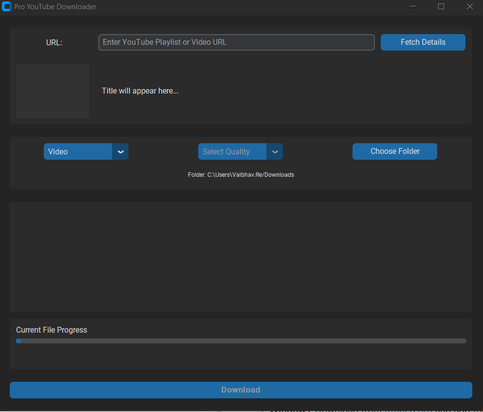
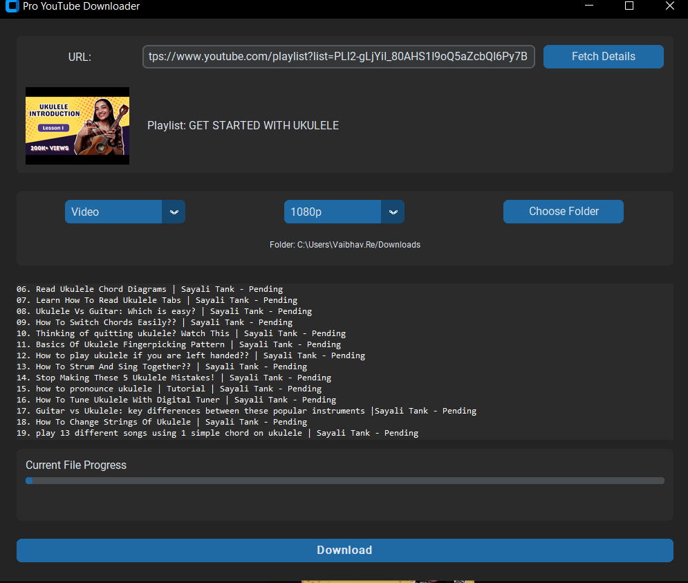
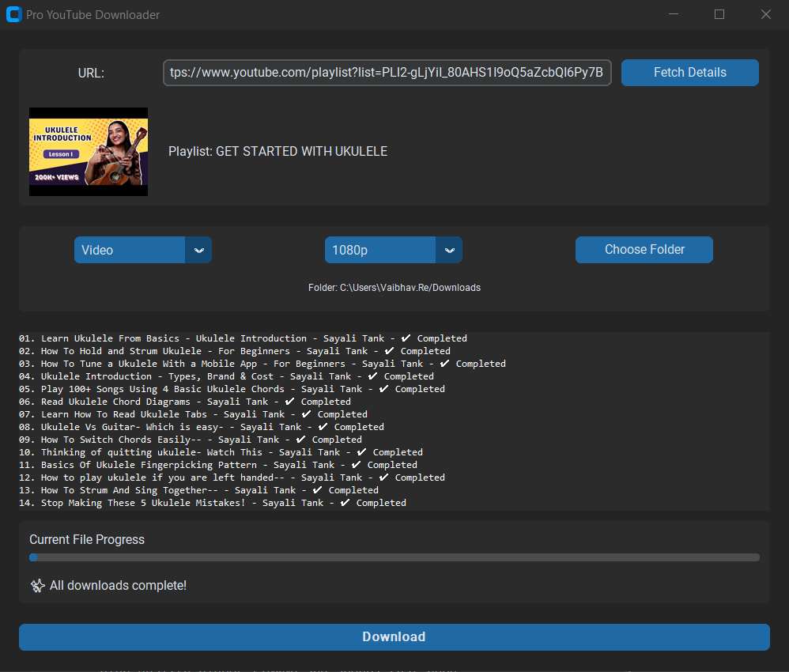

# Pro YouTube Downloader

[](https://www.python.org/)
[](https://github.com/TomSchimansky/CustomTkinter)
[](LICENSE)
[](https://github.com/vaibhav7k/ProYouTubeDownloader/graphs/commit-activity)

A simple, modern, and efficient YouTube video and playlist downloader built with Python, CustomTkinter, and PytubeFix. Designed for speed, reliability, and ease of use.

## 📸 Screenshots

<p align="center">
  
  
  
</p>

---

## ✨ Features

* **🎨 Modern UI**: A clean, dark-themed, and intuitive user interface built with CustomTkinter.
* **📺 Video & Playlist Support**: Download single videos or batch download entire playlists with one click.
* **⚙️ Multiple Quality Options**: Choose your preferred resolution (e.g., 1080p, 720p, 480p) or audio bitrate.
* **🎵 Audio-Only Mode**: Extract and download audio tracks directly as `.mp3` files.
* **⚡ High-Quality Merging**: Automatically merges high-resolution video and audio streams using FFmpeg for the best possible quality.
* **🧵 Non-Blocking Performance**: Fully threaded architecture ensures the UI remains responsive while fetching and downloading.
* **📝 Comprehensive Logging**: Built-in logging for easier debugging and status monitoring.
* **💻 Cross-Platform**: Runs smoothly on Windows, macOS, and Linux.

## 🛠️ Prerequisites

Before you begin, ensure you have the following installed:

1.  **Python 3.8+**: [Download Python](https://www.python.org/downloads/)
2.  **FFmpeg**: **Required** for merging high-quality video and audio streams (1080p+).
    * **Windows**: [Download](https://ffmpeg.org/download.html) and add the `bin` folder to your system's `PATH`.
    * **macOS**: `brew install ffmpeg`
    * **Linux**: `sudo apt update && sudo apt install ffmpeg`

> **⚠️ Important:** Ensure FFmpeg is added to your system's `PATH` environment variable so the application can detect it.

## 🚀 Installation

1.  **Clone the repository:**
    ```bash
    git clone https://github.com/vaibhav7k/ProYouTubeDownloader.git
    cd ProYouTubeDownloader
    ```

2.  **Create and activate a virtual environment:**
    ```bash
    # Windows
    python -m venv venv
    .\venv\Scripts\activate

    # macOS/Linux
    python3 -m venv venv
    source venv/bin/activate
    ```

3.  **Install dependencies:**
    ```bash
    pip install -r requirements.txt
    ```

## 💡 Usage

To launch the application, run the main script from the root directory:

```bash
python main.py
```

### Steps:
1. Paste a YouTube Video or Playlist URL
2. Click **Fetch Details**
3. Select **Video** or **Audio** mode
4. Select your desired **Quality**
5. Click **Download**

## 📦 Building an Executable (.exe)

You can package this application into a standalone executable using **PyInstaller**.

1. **Install PyInstaller:**
   ```bash
   pip install pyinstaller
   ```

2. **Build the App:** Run the following command in the project root:
   ```bash
   pyinstaller --name ProDownloader --onefile --windowed --icon=assets/icon.ico main.py
   ```
   > **Note:** If you don't have an icon, you can remove the `--icon` flag.

3. **Locate the File:** The final `.exe` will be generated in the `dist` folder.

## 📂 Project Structure

```
ProYouTubeDownloader/
├── assets/                # Static files (icons, screenshots)
├── gui/                   # GUI-related modules
│   ├── __init__.py
│   ├── app.py             # Main UI logic and event handling
│   └── ui_components.py   # Reusable UI widgets
├── utils/                 # Backend logic
│   ├── __init__.py
│   ├── helpers.py         # Utility functions (sanitization, etc.)
│   └── youtube_handler.py # Core logic (PytubeFix, FFmpeg)
├── main.py                # Entry point
├── requirements.txt       # Dependencies with pinned versions
├── .gitignore             # Git ignore file
├── LICENSE                # MIT License
├── CONTRIBUTING.md        # Contributing guidelines
└── README.md              # This file
```

## 🔧 Troubleshooting

### FFmpeg not found
- **Windows**: Download from [ffmpeg.org](https://ffmpeg.org/download.html), extract it, and add the `bin` folder to your system `PATH`
- **macOS**: Run `brew install ffmpeg` (requires Homebrew)
- **Linux**: Run `sudo apt update && sudo apt install ffmpeg`

### Application won't start
- Ensure Python 3.8+ is installed: `python --version`
- Verify all dependencies are installed: `pip install -r requirements.txt`
- Check if FFmpeg is in PATH: `ffmpeg -version`

### Download fails
- Check your internet connection
- Verify the YouTube URL is valid and accessible
- Ensure sufficient disk space is available
- Check the application logs for detailed error messages

## 💻 Code Quality

This project maintains professional coding standards:

- ✅ **Type Hints**: All functions include proper type annotations
- ✅ **Docstrings**: Comprehensive documentation for all modules and functions
- ✅ **Logging**: Proper logging throughout for debugging and monitoring
- ✅ **Error Handling**: Specific exception handling with meaningful messages
- ✅ **PEP 8 Compliance**: Code follows PEP 8 style guidelines
- ✅ **Dependency Pinning**: All package versions are pinned for reproducibility

## 🚀 Performance Tips

- **Batch Downloads**: Download entire playlists at once for efficiency
- **Quality Selection**: Choose appropriate quality to balance download time and file size
- **Audio Mode**: Use audio-only mode for faster downloads when video quality isn't needed
- **Disk Space**: Ensure sufficient free disk space before downloading large playlists

## 🤝 Contributing

Contributions are welcome! Please see [CONTRIBUTING.md](CONTRIBUTING.md) for details on how to:

- Report bugs
- Suggest features
- Submit pull requests

## ⚠️ Disclaimer

This software is intended for **educational purposes only**. It should be used to download content you own or content that is publicly available and not protected by copyright.

The end-user is solely responsible for any copyright infringement. The developers of this application assume no liability for misuse.

## � Changelog

### Version 1.0.0 (Initial Release)
- ✨ Video and playlist download support
- 🎵 Audio-only mode (.mp3)
- ⚙️ Multiple quality options
- 🧵 Non-blocking multithreaded UI
- 📝 Comprehensive logging system
- 💻 Cross-platform support

## 🙋 FAQ

**Q: Can I download private videos?**  
A: No, this tool only works with publicly accessible YouTube videos.

**Q: Is there a CLI version?**  
A: Currently only GUI is available. CLI support may be added in future versions.

**Q: Can I use this on a server?**  
A: This is a GUI application. For server-side usage, consider using alternative libraries like `yt-dlp`.

**Q: What formats are supported?**  
A: MP4 for video, MP3 for audio.

**Q: How large are the downloaded files?**  
A: File size depends on video length and selected quality. 1080p videos typically range from 100-500 MB.

## �📄 License

This project is licensed under the **MIT License** - see the [LICENSE](LICENSE) file for details.

## 📞 Support & Contact

- 🐛 Found a bug? Open an [issue](https://github.com/vaibhav7k/ProYouTubeDownloader/issues)
- 💡 Have a suggestion? Start a [discussion](https://github.com/vaibhav7k/ProYouTubeDownloader/discussions)
- 📧 For other inquiries: Check the [CONTRIBUTING.md](CONTRIBUTING.md) file

---

<p align="center">
  <strong>Made with ❤️ by <a href="https://github.com/vaibhav7k">Vaibhav</a></strong>
  <br>
  <sub>⭐ If you found this project helpful, please consider giving it a star!</sub>
</p>